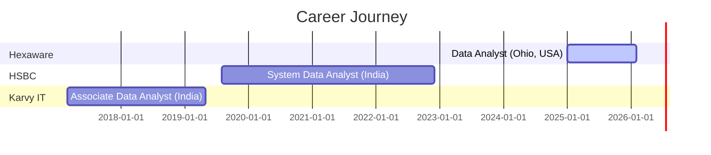

<div align="center">

<!-- Animated Header -->


<!-- Typing Animation -->
<a href="https://git.io/typing-svg"></a>

<!-- Social Badges -->
<p>
<a href="https://victoria-banavath.vercel.app/"></a>
<a href="https://www.linkedin.com/in/victoria-banavath-a348801a3/"></a>
<a href="mailto:victoriabanavath4@gmail.com"></a>
</p>

<!-- Profile Views Counter -->


</div>

---

## 🎯 About Me

```typescript
const victoria = {
    role: "Senior Data Analyst",
    location: "Ohio, USA",
    experience: "7+ years",
    industries: ["Fintech", "Banking", "Financial Services"],
    
    currentFocus: [
        "Building real-time analytics dashboards",
        "Automating data pipelines with Python & SQL",
        "Fraud detection & anomaly analysis"
    ],
    
    impact: {
        manualPrepTimeCut: "40%",
        annualSavings: "$25K",
        dataAccuracy: "100%",
        fraudReduction: "22%"
    }
};
```

---

## 📊 GitHub Stats

<div align="center">


</div>

<div align="center">

</div>

---

## 🛠️ Tech Stack

<div align="center">

### 💻 Languages & Query


### 📊 Data Visualization


### 🗄️ Databases & Cloud


### ⚙️ Tools & Frameworks


</div>

---

## 💼 Experience Timeline



---

## 🚀 Featured Projects

<div align="center">

<a href="https://github.com/Victoriabanavth/Real-Time-Sales-Analytics-Dashboard">
  
</a>
<a href="https://github.com/Victoriabanavth/Customer-Churn-Predictor">
  
</a>

<a href="https://github.com/Victoriabanavth/ETL-Pipeline-Monitor">
  
</a>

</div>

| Project | Demo | Description |
|---------|------|-------------|
| 📊 **Sales Analytics Dashboard** | [Live](https://real-time-sales-analytics-dashboard.vercel.app/) | Real-time KPI visualization with Chart.js |
| 🎯 **Customer Churn Predictor** | [Live](https://customer-churn-predictor-ecru.vercel.app/) | ML-powered churn prediction (89% accuracy) |
| 🔄 **ETL Pipeline Monitor** | [Live](https://etl-pipeline-monitor.vercel.app/) | Real-time pipeline health dashboard |

---

## 📈 Impact Metrics

<div align="center">

| Metric | Value | Impact |
|:------:|:-----:|:------:|
| ⏱️ **Manual Prep Time** | **-40%** | Automated data pipelines |
| 💰 **Annual Savings** | **$25K** | VBA → Python migration |
| ✅ **Data Accuracy** | **100%** | KYC/AML reconciliation |
| 🛡️ **Fraud Reduction** | **22%** | Anomaly detection scripts |
| ⚡ **Weekly Hours Saved** | **12 hrs** | Automated KPI scorecards |

</div>

---

## 🎓 Education

<div align="center">

| Degree | Institution | Year |
|:------:|:-----------:|:----:|
| 🎓 **M.S. Information Technology** | Franklin University | 2025 |
| 🎓 **B.Tech Electronics & Comm.** | Osmania University | 2016 |

</div>

---

## 🐍 Contribution Graph

<div align="center">

</div>

---

## 📫 Let's Connect!

<div align="center">

<a href="https://victoria-banavath.vercel.app/">
  
</a>

<a href="mailto:victoriabanavath4@gmail.com">
  
</a>

<a href="tel:+17409040299">
  
</a>

</div>

---

<div align="center">

<!-- Animated Footer -->


**💡 "Turning raw data into actionable insights, one pipeline at a time."**


</div>
